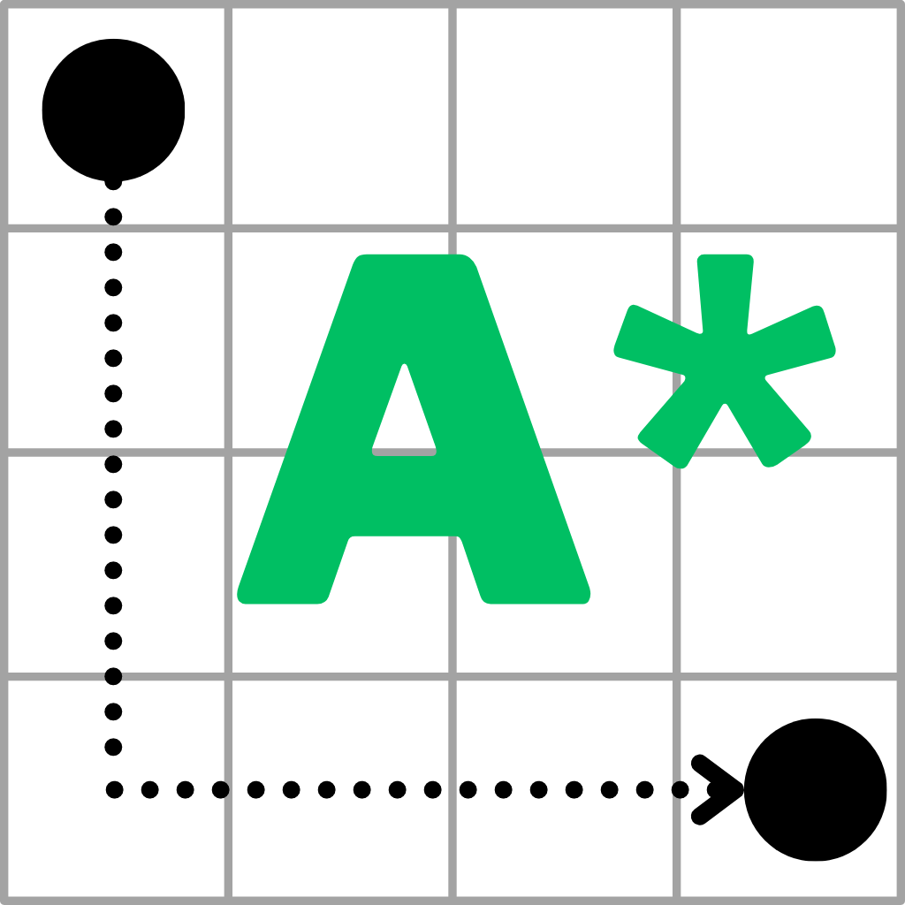

<!-- Improved compatibility of back to top link: See: https://github.com/othneildrew/Best-README-Template/pull/73 -->
<a name="readme-top"></a>

<!-- PROJECT SHIELDS -->
<!--
*** I'm using markdown "reference style" links for readability.
*** Reference links are enclosed in brackets [ ] instead of parentheses ( ).
*** See the bottom of this document for the declaration of the reference variables
*** for contributors-url, forks-url, etc. This is an optional, concise syntax you may use.
*** https://www.markdownguide.org/basic-syntax/#reference-style-links
-->
[![Contributors][contributors-shield]][contributors-url]
[![Forks][forks-shield]][forks-url]
[![Stargazers][stars-shield]][stars-url]
[![Issues][issues-shield]][issues-url]
[![LinkedIn][linkedin-shield]][linkedin-url]


<!-- PROJECT LOGO -->
<br />
<div align="center">
  <a href="https://github.com/aking618/A-Star-Studio">
    
  </a>

<h3 align="center">A* Studio</h3>

  <p align="center">
    MacOS application to visualize pathfinding with A*.
    <br />
    <a href="https://github.com/aking618/A-Star-Studio"><strong>Explore the docs »</strong></a>
    <br />
    <br />
    <a href="#about-the-project">View Demo</a>
    ·
    <a href="https://github.com/aking618/A-Star-Studio/issues">Report Bug</a>
    ·
    <a href="https://github.com/aking618/A-Star-Studio/issues">Request Feature</a>
  </p>
</div>


<!-- TABLE OF CONTENTS -->
<details>
  <summary>Table of Contents</summary>
  <ol>
    <li>
      <a href="#about-the-project">About The Project</a>
      <ul>
        <li><a href="#built-with">Built With</a></li>
      </ul>
    </li>
    <li>
      <a href="#getting-started">Getting Started</a>
      <ul>
        <li><a href="#prerequisites">Prerequisites</a></li>
        <li><a href="#installation">Installation</a></li>
      </ul>
    </li>
    <li><a href="#usage">Usage</a></li>
    <li><a href="#roadmap">Roadmap</a></li>
    <li><a href="#contributing">Contributing</a></li>
    <li><a href="#license">License</a></li>
    <li><a href="#contact">Contact</a></li>
    <li><a href="#acknowledgments">Acknowledgments</a></li>
  </ol>
</details>


<!-- ABOUT THE PROJECT -->
## About The Project

A* Studio is a MacOS application to visualize pathfinding with A*. The application allows the user to determine the size of the grid. The user can then place start and end nodes, as well as barriers. Once the grid is set up, the user can run the A* algorithm to visualize the pathfinding process.

[![A Star Studio Demo Video][product-vod]](product-vod)

<p align="right">(<a href="#readme-top">back to top</a>)</p>


### Built With

* [![Swift][Swift]][Swift-url]
* [![SwiftUI][SwiftUI]][SwiftUI-url]

<p align="right">(<a href="#readme-top">back to top</a>)</p>


<!-- GETTING STARTED -->
## Getting Started

To get a local copy up and running follow these simple steps.


### Installation

1. Clone the repo
   ```sh
   git clone https://github.com/aking618/A-Star-Studio.git
   ```
2. Open the project in Xcode

3. Run the project

<p align="right">(<a href="#readme-top">back to top</a>)</p>

<!-- CONTACT -->
## Contact

Ayren King - ayrenking.dev@gmail.com

Project Link: [https://github.com/aking618/A-Star-Studio](https://github.com/aking618/A-Star-Studio)

<p align="right">(<a href="#readme-top">back to top</a>)</p>


<!-- RESOURCES -->
## Useful Resources

* [A* Pathfinding for Beginners](https://csis.pace.edu/~benjamin/teaching/cs627/webfiles/Astar.pdf)
* [A* (star) Pathfinding](https://medium.com/@nicholas.w.swift/easy-a-star-pathfinding-7e6689c7f7b2)

<p align="right">(<a href="#readme-top">back to top</a>)</p>


<!-- MARKDOWN LINKS & IMAGES -->
<!-- https://www.markdownguide.org/basic-syntax/#reference-style-links -->
[contributors-shield]: https://img.shields.io/github/contributors/aking618/A-Star-Studio.svg?style=for-the-badge
[contributors-url]: https://github.com/aking618/A-Star-Studio/graphs/contributors
[forks-shield]: https://img.shields.io/github/forks/aking618/A-Star-Studio.svg?style=for-the-badge
[forks-url]: https://github.com/aking618/A-Star-Studio/network/members
[stars-shield]: https://img.shields.io/github/stars/aking618/A-Star-Studio.svg?style=for-the-badge
[stars-url]: https://github.com/aking618/A-Star-Studio/stargazers
[issues-shield]: https://img.shields.io/github/issues/aking618/A-Star-Studio.svg?style=for-the-badge
[issues-url]: https://github.com/aking618/A-Star-Studio/issues
[linkedin-shield]: https://img.shields.io/badge/-LinkedIn-black.svg?style=for-the-badge&logo=linkedin&colorB=555
[linkedin-url]: https://linkedin.com/in/ayren-king
[product-vod]: readme/product-vod.gif

[Swift]: https://img.shields.io/badge/Swift-FA7343?style=for-the-badge&logo=swift&logoColor=white
[Swift-url]: https://swift.org/
[SwiftUI]: https://img.shields.io/badge/SwiftUI-34A24F?style=for-the-badge&logo=swift&logoColor=white
[SwiftUI-url]: https://developer.apple.com/xcode/swiftui/